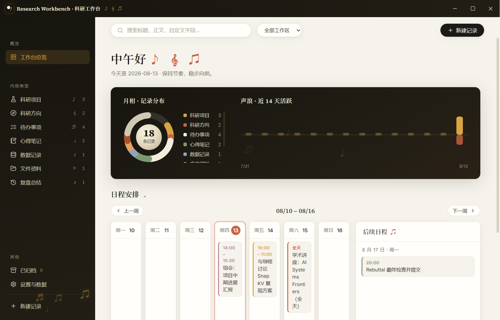
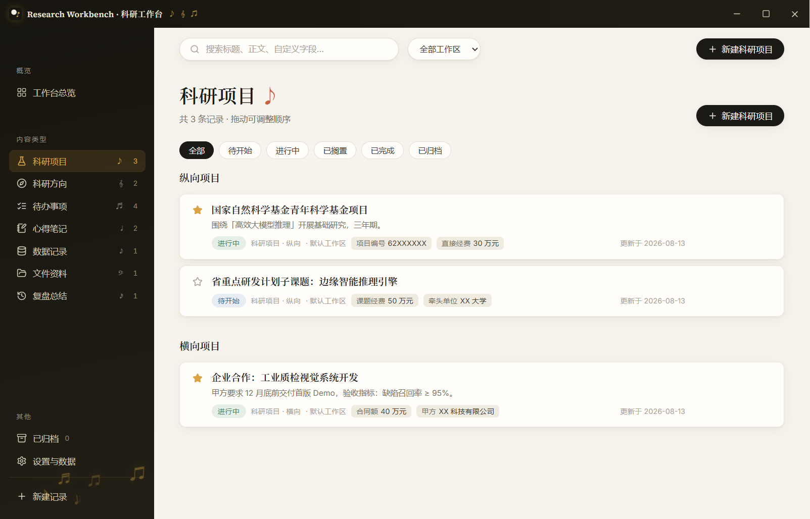
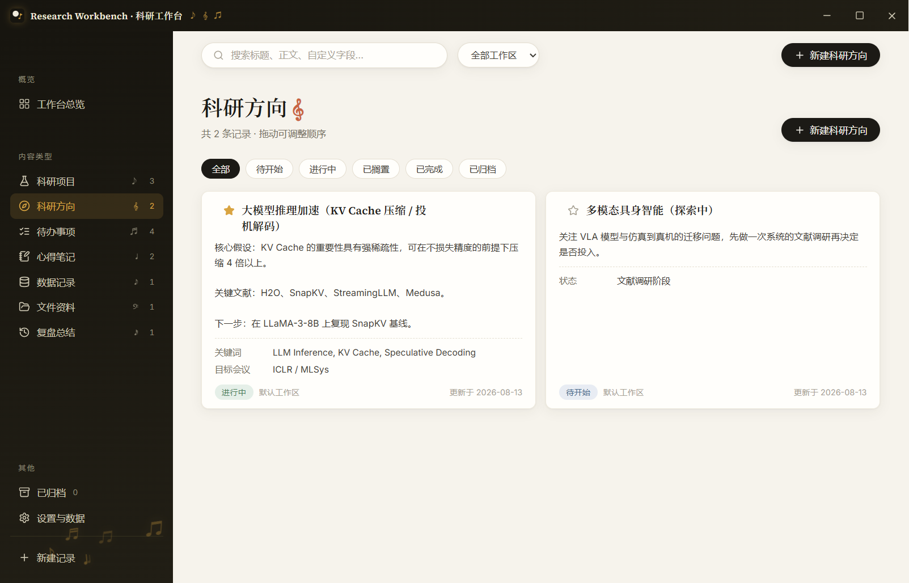
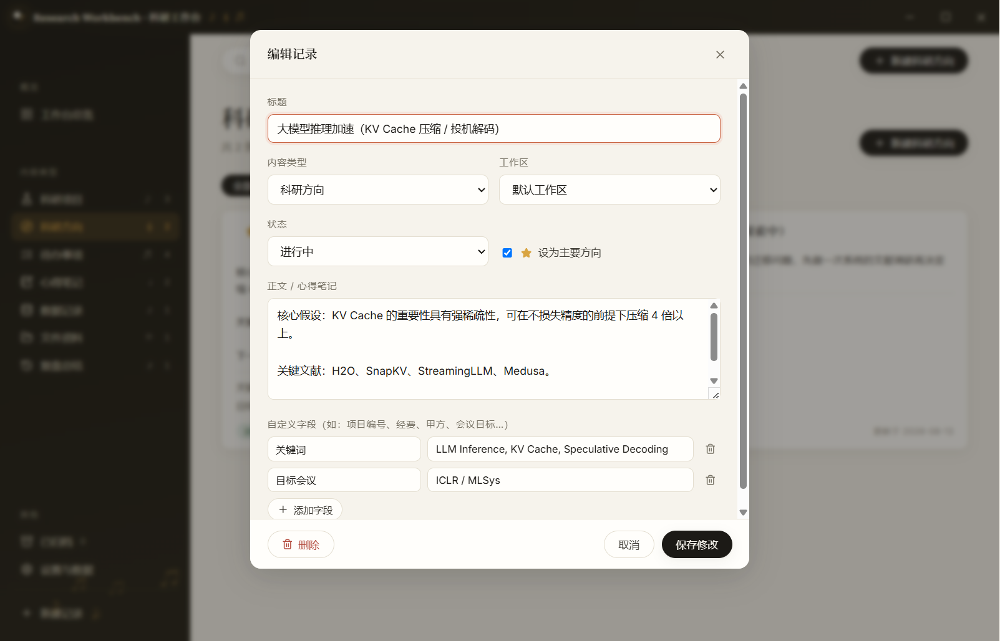
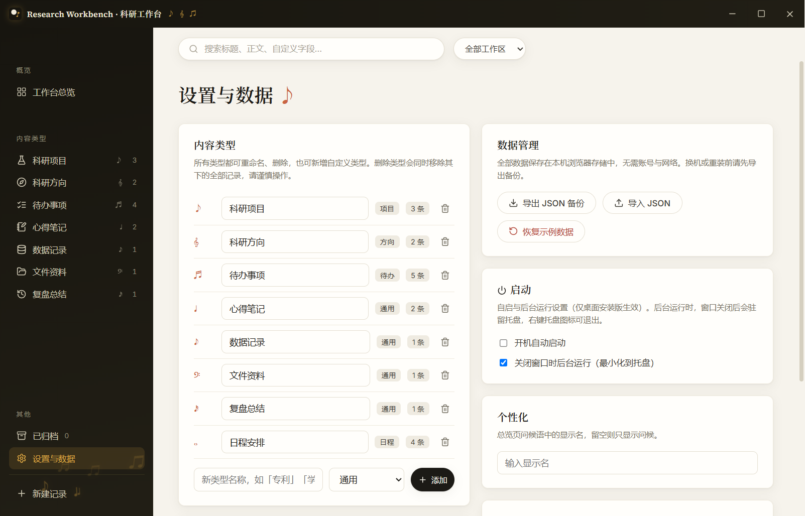

<div align="center">
  

  <h1>Research Workbench · 科研工作台</h1>

  <p><strong>一张桌面，接住科研中的项目、方向、待办与日程。</strong></p>
  <p>A local-first Windows desktop organizer for research projects, directions, tasks, schedules, and notes.</p>

  <p>
    <a href="https://github.com/Layman-art/Research-Workbench/releases/latest"></a>
    <a href="https://github.com/Layman-art/Research-Workbench/actions/workflows/ci.yml"></a>
    
    
    <a href="./LICENSE"></a>
    <a href="https://github.com/Layman-art/Research-Workbench/releases"></a>
  </p>

  <p>
    <a href="https://github.com/Layman-art/Research-Workbench/releases/latest"></a>
  </p>

  <p>
    <a href="#快速开始">快速开始</a> ·
    <a href="#功能一览">功能一览</a> ·
    <a href="#数据与隐私">数据与隐私</a> ·
    <a href="#本地开发">参与开发</a>
  </p>
</div>

<p align="center">
  
</p>

## 为什么做 Research Workbench？

科研信息很容易散落在项目表、日历、待办软件和零碎笔记中：项目进行到哪一步、当前主攻什么方向、下一个截止日期是什么，往往需要在多个地方反复查找。

Research Workbench 不试图替代文献管理器、实验平台或文件系统。它更像一张始终放在桌面的科研控制台，把每条研究线索的当前状态、背景记录和下一步行动放回同一个上下文中。

| 常见的碎片化状态 | Research Workbench 中 |
| --- | --- |
| 纵向、横向项目分散在不同表格 | 在「科研项目」中按纵向 / 横向统一分组 |
| 研究方向只有标题，缺少过程记录 | 用正文、自定义字段和主次方向持续维护 |
| 待办、截止日期和日程彼此割裂 | 待办分组、周日程和总览提醒集中呈现 |
| 数据位置、心得与复盘散落 | 用可定制的记录类型统一登记 |
| 不希望科研数据默认上云 | 本机存储，并支持手动导出 JSON 备份 |

## 功能一览

### 🧭 项目与研究方向

- 科研项目按纵向 / 横向分类展示
- 待开始、进行中、已搁置、已完成等状态
- 主要方向标记、正文记录和自定义字段
- 卡片拖拽排序，以及记录编辑、复制、归档与恢复

### ✅ 待办与日程

- 快速创建待办，支持「我的一天 / 重要 / 全部 / 已完成」分组
- 优先级、截止日期和过期提示
- 周视图、起止时间与后续日程清单
- 总览直接显示本周安排与到期提醒

### 🗂️ 灵活的科研记录

- 内置心得笔记、数据记录、文件资料和复盘总结
- 搜索标题、正文与自定义字段
- 自定义通用类型或待办类型
- 用工作区区分课题组、个人等不同环境

### 🔒 本地优先

- 无需账号，核心功能可离线使用
- 数据自动保存在当前设备
- JSON 备份导出与恢复
- Windows 开机自启与托盘驻留

## 界面预览

<table>
  <tr>
    <td width="50%" align="center">
      
      <br><sub>科研项目：纵向 / 横向分类、状态与自定义字段</sub>
    </td>
    <td width="50%" align="center">
      
      <br><sub>科研方向：主次方向、过程记录与手动排序</sub>
    </td>
  </tr>
  <tr>
    <td width="50%" align="center">
      
      <br><sub>随内容类型变化的记录编辑器</sub>
    </td>
    <td width="50%" align="center">
      
      <br><sub>内容类型、工作区、JSON 备份与桌面启动设置</sub>
    </td>
  </tr>
</table>

## 快速开始

1. 从 [GitHub Releases](https://github.com/Layman-art/Research-Workbench/releases/latest) 下载 `Research-Workbench-Setup-release-x64.exe`。
2. 运行安装程序并选择安装位置。普通用户无需安装 Node.js。
3. 首次启动会载入一组可编辑的科研示例数据，可以先用它熟悉项目、待办与日程。
4. 正式使用后，建议定期在「设置与数据 → 数据管理」中导出 JSON 备份。

默认情况下，关闭主窗口后应用仍会驻留系统托盘。需要彻底退出时，可右键托盘图标选择「退出」，也可以在设置中关闭后台运行。

> [!IMPORTANT]
> 当前 Windows 安装包尚未进行代码签名，系统可能显示「未知发布者」提示。请只从本仓库的 Releases 页面下载，并在安装前核对对应版本发布说明中的 SHA-256。

在 PowerShell 中校验安装包：

```powershell
Get-FileHash .\Research-Workbench-Setup-release-x64.exe -Algorithm SHA256
```

## 数据与隐私

Research Workbench 当前没有账号系统或云同步。项目、记录、内容类型、工作区和显示名保存在应用本机存储中；开机自启与托盘设置保存在 Electron 的用户数据目录。

JSON 备份需要手动导出。当前版本不提供自动备份、跨设备同步或应用层加密，因此换机、重装或处理重要数据前，请先导出备份。

<details>
<summary><strong>当前版本的能力边界</strong></summary>

- 仅提供 Windows x64 发行版。
- 面向单机、单用户场景，不含云同步和实时协作。
- 「文件资料」用于记录文件位置和说明，不托管文件本体。
- 正文为纯文本记录，不是富文本或 Markdown 编辑器。
- 暂无自动备份、自动更新和应用层数据加密。

</details>

## 本地开发

环境要求：Node.js 20.19+，或 Node.js 22.12+。

```bash
git clone https://github.com/Layman-art/Research-Workbench.git
cd Research-Workbench
npm ci
npm run dev:electron
```

浏览器预览：

```bash
npm run dev
```

质量检查：

```bash
npm run lint
npm test
npm run test:e2e
npm run build
```

构建 Windows 安装包与便携版：

```bash
npm run dist
```

## 技术栈

- Electron + electron-builder
- React + TypeScript + Vite
- Zustand
- Vitest + Playwright

## 项目结构

```text
electron/          Electron 主进程与安全预加载桥
src/               React + TypeScript 应用源码
src/components/    总览、记录、待办、日程、编辑器与设置
src/test/          单元测试与端到端测试
scripts/           应用图标生成脚本
docs/assets/       README 展示图片
licenses/          随发行版分发的第三方许可证文本
```

## 参与贡献

欢迎提交 Issue 或 Pull Request。开始之前请先阅读 [CONTRIBUTING.md](./CONTRIBUTING.md)。隐私与安全说明见 [PRIVACY.md](./PRIVACY.md) 和 [SECURITY.md](./SECURITY.md)。

## 开源许可证

Research Workbench 采用 [MIT License](./LICENSE) 开源。第三方组件的许可证与版权说明见 [THIRD_PARTY_NOTICES.md](./THIRD_PARTY_NOTICES.md)。

## 更新日志

版本变化见 [CHANGELOG.md](./CHANGELOG.md)，可安装文件与校验值见 [Releases](https://github.com/Layman-art/Research-Workbench/releases)。
